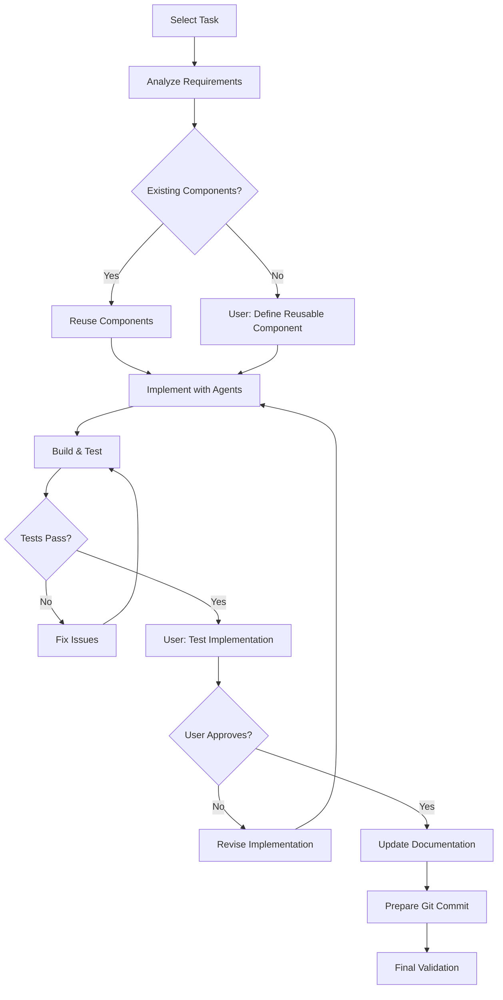

# Task Execution Workflow

## Purpose
Guide step-by-step feature development with automatic agent activation, user interaction at key decision points, and comprehensive validation before any code is committed.

<commentary>
The key to successful execution is not doing too much at once. Each step should be validated with the user, and the system should automatically ensure best practices through agent activation.
</commentary>

## Execution Flow Overview



## Step-by-Step Execution Process

### Phase 1: Task Initialization and Analysis
```markdown
## 1.1 Task Selection and Context Loading
**Automatic Actions**:
- Load task from current-sprint.md
- Identify required agents based on task type
- Load existing component registry
- Check architecture documentation

**User Checkpoint**: 
"I'm about to implement: [Task Title]. The task involves [brief description]. 
Ready to proceed? (y/n)"

## 1.2 Component Reuse Analysis
**Automatic Agent Activation**: 
- UI Frontend Agent scans for existing components
- Knowledge base checks component registry
- Architecture analyzer identifies patterns

**Decision Tree**:
IF existing_component_found:
    SHOW: "Found existing component: [ComponentName] that could be reused/extended"
    USER_DECISION: "Would you like to: 
        1. Reuse as-is
        2. Extend existing component
        3. Create new component
        Choice: "
ELSE:
    SHOW: "No existing component found for this functionality"
    USER_DECISION: "This looks like a reusable component opportunity. 
        Should I create a reusable component? (y/n)"
    IF yes:
        USER_INPUT: "Please describe the reusable component requirements:
            - Component name:
            - Props/parameters:
            - Variations needed:
            - Future use cases:"
```

### Phase 2: Implementation with Automatic Agent Activation
```markdown
## 2.1 Test-First Development (Automatic)
**Activated Agents**: TDD Enforcer + Domain Specialist

**Automatic Actions**:
1. Generate test templates based on task type
2. Create failing tests for acceptance criteria
3. Show tests to user for validation

**User Checkpoint**:
"Here are the tests I'll write first: [show test structure]
These cover: [list what's being tested]
Look good? (y/n/modify)"

## 2.2 Implementation with Best Practices (Automatic)
**Activated Agents Based on Task Type**:
- SwiftUI Component → UI Frontend Agent + Accessibility Expert
- Service/Model → Backend Agent + Security Expert  
- Integration → Multiple domain agents + Task Coordinator

**Automatic Best Practice Enforcement**:
### For UI Components:
- ✅ Accessibility-first implementation (VoiceOver, Dynamic Type)
- ✅ Native design patterns (Assets.xcassets, SF Symbols)
- ✅ Component composition and reusability
- ✅ Performance optimization (lazy loading, efficient rendering)

### For Backend Services:
- ✅ Protocol-first design for testability
- ✅ Comprehensive error handling
- ✅ Secure data storage (Keychain for sensitive data)
- ✅ Input validation and sanitization

**Progressive Implementation**:
1. Implement minimum to pass first test
2. Show implementation to user
3. Get approval before proceeding
4. Implement next test/feature
5. Repeat until acceptance criteria met
```

### Phase 3: Build Validation and Testing
```markdown
## 3.1 Automatic Build and Test Execution
**Automatic Actions**:
```bash
# 1. Run unit tests
swift test

# 2. Run UI tests (command will be configured by best-practice-analyzer agent)
# [UI_TEST_COMMAND]

# 3. Check accessibility compliance
# Automated accessibility audit

# 4. Verify code coverage
# Must meet 95% for business logic
```

**Build Results Handling**:
IF build_succeeds AND tests_pass:
    PROCEED to user testing
ELSE:
    ACTIVATE: Bug Fixing Specialist
    SHOW: "Build/test issues found: [details]"
    FIX: Issues with user visibility
    RETRY: Build and test

## 3.2 User Testing Checkpoint
**User Prompt**:
"✅ All tests are passing and the build succeeded!

Please test the implementation:
1. Run the app in Xcode
2. Navigate to: [specific location]
3. Test: [specific functionality]
4. Verify: [acceptance criteria]

Does everything work as expected? (y/n/issues)"

**Issue Handling**:
IF user_reports_issues:
    DOCUMENT: Specific issues
    ACTIVATE: Appropriate specialist agent
    FIX: Issues with test coverage
    RETURN: To build validation
```

### Phase 4: Documentation and Git Workflow
```markdown
## 4.1 Automatic Documentation and Task Completion
**Activated Agents**: Documentation Agent + Knowledge Updater

**Automatic Updates**:
1. **Component Registry**: 
   - Add new reusable components with usage examples.
2. **Architecture Documentation**:
   - Update system architecture if new patterns introduced.
3. **API Documentation**:
   - Generate/update API docs for new services.
4. **Feature Documentation**:
   - Create/update feature documentation.
5. **Task Completion**:
   - **Action**: Find the task "[Task Title]" in `pro-vibe-dev/tasks/current-sprint.md` and mark it as complete by adding "✅" before the task title.

**User Review**:
"Documentation has been updated and the task has been marked as complete.

Review documentation? (y/n/skip)"

## 4.2 Git Commit and Push
**Automatic Pre-Commit Checks**:
- All tests passing
- Code coverage meets standards
- No accessibility violations
- No security issues
- Documentation current

**Commit Message Generation**:
"Based on the implementation, here's the suggested commit message:

feat: [component/feature name] with [key capabilities]

- Implemented [main functionality]
- Added comprehensive tests (X% coverage)
- Ensured accessibility compliance (VoiceOver, Dynamic Type)
- Created reusable [component name] for future use

Closes: [task ID]

Approve this commit message? (y/edit/cancel)"

**User Checkpoint**:
"Would you like to commit and push the changes? (y/n)"

**On User Approval**:
- **Action**: `git add .`
- **Action**: `git commit -m "[approved message]"`
- **Action**: `git push`

**Post-Push Confirmation**:
"✅ Changes have been committed and pushed successfully!

Next steps:
1. Create PR if needed
2. Start next task: [show next priority]"
```

## Automatic Agent Activation Rules

### By File Type
```yaml
swiftui_files:
  primary: ui-frontend
  automatic: [accessibility-expert, tdd-enforcer]
  validation: [performance-optimizer]

service_files:
  primary: backend
  automatic: [tdd-enforcer, security-expert]
  validation: [performance-optimizer]

test_files:
  primary: qa-testing
  automatic: [tdd-enforcer]
  validation: [coverage-analyzer]
```

### By Task Type
```yaml
ui_component_task:
  agents: [ui-frontend, accessibility-expert]
  validations: [voiceover, dynamic-type, color-contrast]
  reusability_check: required

backend_service_task:
  agents: [backend, security-expert]
  validations: [api-design, error-handling, security]
  protocol_first: required

integration_task:
  coordinator: task-coordinator
  agents: [relevant-domain-agents]
  validations: [end-to-end-testing, performance]
```

## User Interaction Points Summary

### Required User Checkpoints
1. **Task Confirmation**: Before starting implementation
2. **Component Reuse Decision**: Use existing or create new
3. **Test Approval**: Verify test coverage before implementation
4. **Progressive Review**: After each implementation step
5. **Build Success Testing**: Manual testing after automated tests pass
6. **Documentation Review**: Verify updates before commit
7. **Commit Approval**: Final approval before creating commit

### Optional Interaction Points
- Review implementation details at any step
- Modify generated tests or code
- Add additional requirements mid-implementation
- Skip documentation review if trusted

## Quality Gates Integration

### Automatic Throughout Execution
- **Accessibility**: Every UI change validated
- **Testing**: TDD enforced, coverage monitored
- **Security**: Automatic scanning for vulnerabilities
- **Performance**: Build time and runtime monitoring
- **Documentation**: Kept current with implementation

### No Commit Without
- ✅ All tests passing
- ✅ Build succeeding  
- ✅ User manual testing approved
- ✅ Documentation updated
- ✅ Task marked complete
- ✅ Knowledge base current

## Usage Examples

### Execute a UI Task
```bash
claude-code --task="Use task-execution.md to implement 'Create User Avatar Component' task from current sprint"

# Flow:
# 1. Analyzes task, finds no existing avatar component
# 2. Asks user about creating reusable component
# 3. Generates tests first (TDD)
# 4. Implements with UI Frontend + Accessibility agents
# 5. Builds and runs tests automatically
# 6. Prompts user to test in Xcode
# 7. Updates component registry and docs
# 8. Prepares commit after user approval
```

### Execute Backend Task
```bash
claude-code --task="Use task-execution.md to implement 'User Authentication Service' task"

# Flow:
# 1. Analyzes task, checks for existing auth patterns
# 2. Activates Backend + Security + TDD agents
# 3. Creates protocol-first design with tests
# 4. Implements with security best practices
# 5. Validates Keychain usage, error handling
# 6. Full test suite execution
# 7. API documentation generation
# 8. Commit only after all validations pass
```

<commentary>
This workflow ensures that development is methodical, quality is built-in through automatic agent activation, and the user maintains control at key decision points. No code is committed until it's tested, documented, and approved by the user.
</commentary>